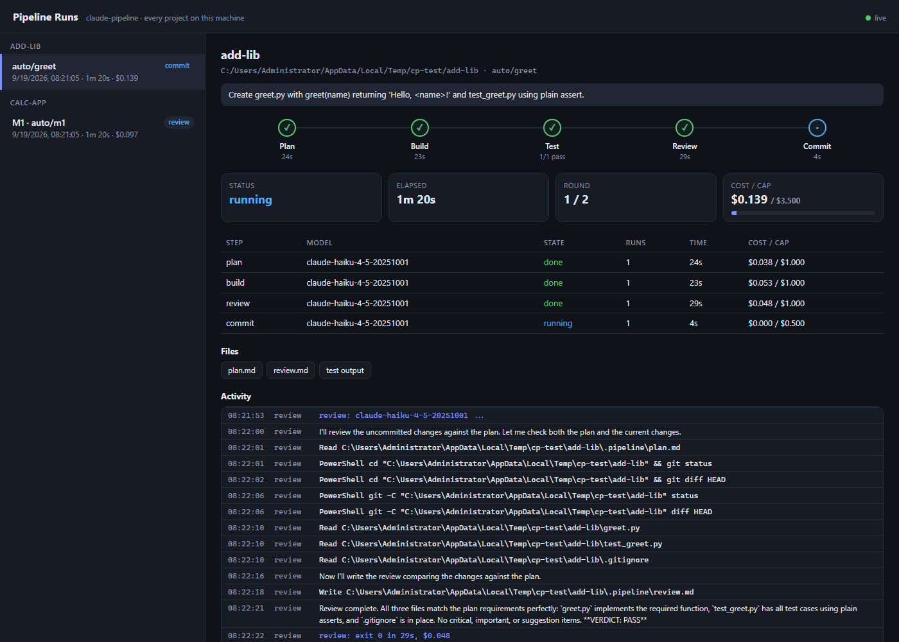

# claude-pipeline

A Claude Code plugin that takes you from a rough idea to tested, reviewed code, one milestone at a time. Works in any local folder: git is optional, and GitHub is never required.

```
/discover  →  SPEC.md + ROADMAP.md          (interactive: you answer ≤ 12 questions)
/setup-pipeline  →  one milestone, automated:

  Plan (Opus) → plan check → Build (Sonnet) → quality gates → Review (read-only) → Commit (Haiku)
                                  ↑_ a failing gate goes straight back to Build; review only runs when gates pass _|

/setup-pipeline next  →  the next milestone
```

- **`/discover`** turns a vague, hand-typed idea ("build me a card RPG with...") into a spec: it asks one question at a time (max 12), helps you pick a tech stack from 2-3 compared options, and writes `SPEC.md`, `ROADMAP.md` and a short `CLAUDE.md`.
- **`/setup-pipeline`** builds one milestone (or any clear request) with a four-step headless pipeline. Each step is a separate `claude -p` run whose **permissions are locked by its tool list**, not just by instructions: the planner can only write `plan.md`, the reviewer can only write `review.md` and run read-only git, the committer has no file-editing tools. Between the steps run two checks that cost **no model tokens**: a **plan check** (a structured plan with a test matrix, every acceptance criterion mapped) and **quality gates** (tests, lint, types, secrets, "every AC has a test", and more, using established tools such as gitleaks, ruff, eslint and osv-scanner). If gates or review still fail after the fix loops, **nothing is committed**.

## Install

### Step 1: Check you have three things

In a terminal (PowerShell on Windows, Terminal on macOS/Linux):

```bash
claude --version   # Claude Code
git --version      # Git (the program is needed even if your project does not use git)
node --version     # Node.js 18 or newer
```

Missing one? Install it:

| Missing | Install |
|---|---|
| `claude` | https://docs.claude.com/en/docs/claude-code/setup, then run `claude` once to log in |
| `git` | Windows: https://git-scm.com/download/win · macOS: `xcode-select --install` · Linux: `sudo apt install git` |
| `node` | https://nodejs.org (LTS) |

Open a **new** terminal afterwards and run the three commands again.

### Step 2: Install the plugin

Start Claude Code (`claude`) and type these two commands in the chat:

```
/plugin marketplace add Punssama/CLAUDE_PIPELINE
```

```
/plugin install claude-pipeline@punssama
```

If asked for a scope, choose **user** so it works in every project.

<details>
<summary>Alternative: install from the terminal</summary>

```bash
claude plugin marketplace add Punssama/CLAUDE_PIPELINE
claude plugin install claude-pipeline@punssama
```

</details>

### Step 3: Restart and check

1. Quit Claude Code (`/exit`) and start it again: plugins load when a session starts.
2. Run `/plugin` → **Installed**: `claude-pipeline` should be **enabled** (or run `claude plugin list` in a terminal).
3. Type `/disc` and `/setup` in the chat: `discover` and `setup-pipeline` should appear in the suggestions.

### Update / uninstall

```
/plugin marketplace update punssama          # update, then restart Claude Code
/plugin uninstall claude-pipeline@punssama   # uninstall
/plugin marketplace remove punssama
```

### Install problems

| Problem | Fix |
|---|---|
| `Permission denied (publickey)` on `marketplace add` | No GitHub SSH key. Use HTTPS: `/plugin marketplace add https://github.com/Punssama/CLAUDE_PIPELINE.git`. Still failing? Run once: `git config --global url."https://github.com/".insteadOf git@github.com:` |
| `/discover` or `/setup-pipeline` not listed | Restart Claude Code. On a name clash use `/claude-pipeline:discover` or `/claude-pipeline:setup-pipeline` |
| Pipeline says `cannot run claude` | `claude` is not on the terminal's PATH. Open a new terminal and run `claude --version`; reinstall Claude Code if it fails |
| `node: command not found` | Node.js is not installed, or the terminal was opened before installing it |

## Usage

### From an idea

```
/discover a turn-based card RPG where the player builds a deck and fights through 3 floors
```

1. **Where**: if you are not in a project, it asks for a name and folder, then creates it with `git init` and a first commit.
2. **Interview**: one question per message, each with a recommended answer you can just accept. It covers users, core flows (written as testable acceptance criteria `AC-1..n`), non-goals, platform, data, integrations, constraints and "done". Say "enough" or "you decide" at any point and it fills the rest with recorded assumptions.
3. **Stack**: 2-3 options compared (fit, pitfalls, testable from the command line?). It prefers stacks the pipeline can test headlessly and, for games and apps, separates core logic from the UI.
4. **Documents**: `SPEC.md`, `ROADMAP.md` (2-6 runnable milestones, each listing its ACs; M1 is always skeleton + test runner + first slice) and a short `CLAUDE.md`. You approve them, then they are committed.

Then build milestone by milestone:

```
/setup-pipeline          # builds M1
/setup-pipeline next     # builds the next unticked milestone
```

### From a clear request (existing project)

```
/setup-pipeline add a /health endpoint returning {"status":"ok"}, with a test
```

A readiness gate checks four things: outcome, scope, stack and done criteria. If one or two are missing it asks up to 3 questions; if the request is really a product idea, it sends you to `/discover` instead of guessing.

It does not dead-end: typing `/setup-pipeline` or `/setup-pipeline next` in a project without a roadmap suggests 2-3 sensible next changes from the code and the last run, and every blocker (no git, uncommitted work, an unmerged previous run) comes with a recommended fix it applies once you agree.

### What `/setup-pipeline` does

| Phase | What happens | You |
|---|---|---|
| 0. Get ready | Finds the project and fixes blockers after asking: no git yet, uncommitted changes, a previous run left on its `auto/...` branch | Pick a fix (one is recommended) |
| 1. Mode | Milestone (SPEC + ROADMAP exist) or request (readiness gate) | Answer ≤ 3 questions if needed |
| 2. Tier + toolkit | Quality tier (Economy / Balanced / Premium), then framework and add-ons; reuses the previous run's choices on `next` | Choose |
| 3. Gates + config | Shows which quality gates would run and which tools are missing, then writes `.pipeline/config.json` with a summary of the max budget | Pick Standard / Strict / Minimal, confirm |
| 4. Run | Plan → plan check → Build → gates → Review → Commit on a new `auto/...` branch | Approve the plan if you chose to pause |
| 5. Merge | Merges the branch into main, ticks the milestone in ROADMAP.md, saves the outcome to agentmemory if used | Confirm the merge |

### Plan check: a plan the builder can follow

The planner fills in a fixed structure (`plan-template.md`): **Goal, Non-goals, Assumptions, Interfaces, Tasks** (each with `Files`, `Do`, `Verify`), a **Test matrix** (which test proves which requirement, and what it asserts), **Risks and rollback**, and the **Test command**. A lint (`planlint.mjs`, no model, milliseconds) then checks it:

- every required section exists and no `{{placeholder}}` is left over;
- every task names its files and how to verify it, and in milestone mode the acceptance criterion it satisfies;
- **every AC of the milestone is mapped to a task and to a Test matrix row** that names a test and what it asserts (`AC-1` is not satisfied by a mention of `AC-10`);
- warnings for vague wording (`TBD`, `etc.`), plans over 250 lines, more than 12 tasks, or a task touching more than 6 files.

Problems go back to the planner once, with the exact list and an instruction not to explore the repo again. What it cannot fix stops the run (exit 3) or, with plan review on, is listed in the editor for you. You can lint any file yourself: `node <plugin>/skills/setup-pipeline/planlint.mjs plan.md --acs AC-1,AC-2`.

### Quality gates: CI-style checks before every review

After every Build the runner runs **quality gates**. The review starts only when the blocking ones pass, so you never pay a reviewer to find a failing test or a type error.

| Gate | What it checks | Blocks | Needs |
|---|---|---|---|
| `tests` | Your test command: the SPEC.md Commands table, `scripts.test`, `node --test`, pytest or unittest, `go test`, `cargo test` | yes | your project's runner |
| `lint` | `npm run lint`, eslint, biome, ruff, golangci-lint or `go vet`, clippy | yes | the tool and its config (ruff without a config checks real errors only, no style noise) |
| `types` | `npm run typecheck`, `tsc --noEmit`, mypy or pyright when configured, `cargo check` | yes | the tool and its config |
| `build` | `npm run build`, `go build` | yes | a build script |
| `secrets` | Secrets in the **lines this run added** (values are never printed; reports `file:line`) | yes | nothing: built-in patterns; **gitleaks** if installed |
| `trace` | Every AC id of the milestone appears in a test file (name, docstring or comment) | yes | milestone mode |
| `size` | More than 800 added lines or 25 files: "split the milestone" | no | nothing |
| `audit` | Known vulnerabilities in your dependencies | no | osv-scanner, else trivy, pip-audit or `npm audit` |
| `precommit` | The hooks of your `.pre-commit-config.yaml`, on the changed files | yes | pre-commit or prek |

**Presets:** `minimal` = tests, secrets, trace · `standard` (default) = minimal + lint, types, build, size · `strict` = standard + audit, precommit. Advisory gates (`size`, `audit`) are reported but never block: a known vulnerability in an old dependency cannot be fixed by a fix loop.

How a round works:

- **All gates run every round**, so the builder gets every failure at once, with trimmed output (head and tail, repo-relative paths, no colour codes).
- **A blocking failure goes straight back to Build and the review is skipped.** The fix prompt says: fix what the output reports, and never silence a check (no `noqa`, `eslint-disable`, `@ts-ignore`, skipped or deleted tests, loosened assertions or config edits).
- **The same gate failure twice in a row stops the loop** ("no progress"): identical tool output means the fix changed nothing that matters, so no more fix rounds are paid for it.
- **Once the gates pass, the reviewer skips style and types** and spends its effort on what tools cannot check: does each test prove its requirement ("would it fail if the feature were broken?"), edge cases, security, plan deviations.
- Milestone mode: the builder is told that every AC id must appear in a test, and the `trace` gate enforces it.
- Gates run with `CI=1` and `NO_COLOR=1`, your project's own tools first (`node_modules/.bin`, `.venv`), and a timeout kills the whole process tree. **Tools are detected on every run, after the build, and never installed silently**: a missing one skips its gate with an install command (`node <plugin>/skills/setup-pipeline/gates.mjs --tools py`).

Configure in `.pipeline/config.json`:

```json
"gates": "standard"
"gates": ["tests", "lint"]
"gates": { "preset": "standard", "add": ["audit"], "warn": ["types"], "skip": ["build"],
           "custom": [{ "id": "e2e", "cmd": "npx playwright test", "timeoutSec": 600 }] }
```

`warn` reports a gate without blocking, `block` promotes an advisory one, `custom` runs any command (exit 0 = pass). `testCmd` still overrides the Tests gate, and a config from before gates existed keeps gating on its `testCmd` alone. Try the gates on any folder without running the pipeline:

```bash
node <plugin>/skills/setup-pipeline/gates.mjs --detect standard   # what would run here, what is missing
node <plugin>/skills/setup-pipeline/gates.mjs --run strict         # run them now
```

**Established tools, integrated rather than reimplemented** (stars and licenses as of 2026-09-19):

| Tool | Used for | Stars | License | Command verified* |
|---|---|---|---|---|
| [gitleaks](https://github.com/gitleaks/gitleaks) | `secrets`: scans only the added lines, mapped back to `file:line` | 29.4k | MIT | yes |
| [trivy](https://github.com/aquasecurity/trivy) | `audit`: vulnerabilities and secrets in the tree | 38.0k | Apache-2.0 | yes |
| [osv-scanner](https://github.com/google/osv-scanner) | `audit`: dependency vulnerabilities, any ecosystem | 11.1k | Apache-2.0 | yes |
| [pip-audit](https://github.com/pypa/pip-audit) | `audit`: Python | 1.4k | Apache-2.0 | yes |
| `npm audit` | `audit`: Node | (npm) | (npm) | yes |
| [ruff](https://github.com/astral-sh/ruff) | `lint`: Python | 49.7k | MIT | yes |
| [mypy](https://github.com/python/mypy) | `types`: Python | 20.6k | MIT | yes |
| [pyright](https://github.com/microsoft/pyright) | `types`: Python | 15.6k | MIT | no |
| [pytest](https://github.com/pytest-dev/pytest) | `tests`: Python | 14.5k | MIT | yes |
| [eslint](https://github.com/eslint/eslint) | `lint`: JS/TS | 27.5k | MIT | yes |
| [biome](https://github.com/biomejs/biome) | `lint`: JS/TS | 25.8k | Apache-2.0 | no |
| [TypeScript](https://github.com/microsoft/TypeScript) | `types`: `tsc --noEmit` | 111k | Apache-2.0 | yes |
| [golangci-lint](https://github.com/golangci/golangci-lint) | `lint`: Go (run as a separate program) | 19.4k | GPL-3.0 | no |
| [pre-commit](https://github.com/pre-commit/pre-commit) | `precommit`: your existing hooks | 15.6k | MIT | yes |

\* "Yes" means the exact command was run on Windows against a fixture with a real finding and a clean case, and its exit codes and output were checked (the plugin's own automated tests do not need these tools installed). "No" means it follows the tool's documented CLI but has not been run yet (Go and Rust toolchains were not available where the plugin was developed, so `go test`, `go vet`, `go build` and the `cargo` commands are unverified too); the dashboard marks such gates with ⓘ. Worth adding yourself as `custom` gates: [semgrep](https://github.com/semgrep/semgrep) (16.7k, LGPL-2.1; Linux, macOS, WSL) `semgrep scan --config auto --error`, and mutation testing to check that tests can actually fail: [Stryker](https://github.com/stryker-mutator/stryker-js) (3.1k) `npx stryker run`, [mutmut](https://github.com/boxed/mutmut) (1.4k) `mutmut run`, [cargo-mutants](https://github.com/sourcefrog/cargo-mutants) (1.3k) `cargo mutants`. These examples are not exercised by the plugin's tests. trufflehog (28k) is AGPL-3.0 and is not used.

### Git or no git

| Your setup | What the pipeline does |
|---|---|
| **Local git repo** (no GitHub needed) | Each run gets its own `auto/...` branch; Haiku writes the commit; after review you merge it into `main`. Push only if you ask for it |
| **Plain folder, no git** (`"vcs": "none"`) | Changes go straight into the folder. A private history in `.pipeline/` (your folder gets no `.git`) lets the reviewer see the diff and lets you undo the last run with one command. The commit step is skipped, so runs are a little cheaper |

`/setup-pipeline` asks which one you want the first time it meets a folder without git. Undo a no-git run:

```bash
node <plugin>/skills/setup-pipeline/pipeline.mjs .pipeline/config.json --undo
```

(or just ask Claude to undo the last pipeline run). It restores every file to how it was before that run.

### Live dashboard

When a run starts, Claude sends you a link like `http://127.0.0.1:3120/#run=...`. You get a link earlier too: `/discover` gives it with the summary of what it wrote, and `/setup-pipeline` right after it finds your project, so you can **read `SPEC.md` and `ROADMAP.md` rendered as Markdown before anything is built** (`#project=<id>`; the **Documents** list in the sidebar; the page re-reads the files every couple of seconds, so edits show up while you read). One local page shows **every pipeline run on the machine**, across all your projects:

- step progress (Plan → Build → Gates → Review → Commit), elapsed time and fix-loop round
- **real cost** per step and in total, against the budget cap
- a live feed of every file read or edited and every command each step runs
- **quality gates per round**: one row per gate with pass / FAIL / warning / skipped, time, and the one line that says what went wrong (or which tool to install); Critical review findings; and `plan.md` / `review.md` / gate output
- runs that were killed mid-way are marked `stopped`
- filters (All / Running / Failed), tabs for Activity and the files, a step filter and a Follow toggle for the live feed
- a **full-screen reader/editor** for the plan (and read-only for review and gate output), plus a banner on runs that wait for your plan review
- `plan.md` and `review.md` are **rendered as Markdown** (headings, tables, task lists, code, a coloured `VERDICT` badge); tick **Raw** to see the source. Rendering is hardened: raw HTML in the files is shown as text, images are never fetched, only `http(s)` links are clickable, and a Content-Security-Policy blocks foreign scripts and requests



It uses the first free port from 3120 up, listens on `127.0.0.1` only (and refuses other host names), and stops by itself when the last Claude Code session closes (a small SessionStart/SessionEnd hook keeps count). Open it any time by asking Claude for the pipeline dashboard.

**History is kept until you delete it.** Every run is saved in `~/.claude-pipeline/runs/` (override with `CLAUDE_PIPELINE_HOME`), so stopping the dashboard, closing Claude or rebooting loses nothing. To tidy up, use **Delete run** on a run, or **Clear finished** next to a project name to remove all its finished runs. Running pipelines cannot be deleted, and deleting only removes the dashboard record: your project files are never touched.

### Review and edit the plan (you are not bound to the AI's plan)

With `pauseAfterPlan: true` (recommended for the first runs and for anything touching auth, payments or data), the pipeline stops after the planner and nothing is built until you say so. Claude summarizes the plan in your session and gives you a link; you can:

| You want to | Do |
|---|---|
| **Read** the plan comfortably | Open the link: **full-screen** reader with adjustable text size (A− / A+). Review and gate output open the same way |
| **Change** the plan yourself | **Edit** mode: Markdown source on the left, live preview on the right; `Ctrl+S` saves to `.pipeline/plan.md`, which is what the build reads. **Changes** shows exactly what you changed compared with the plan the AI wrote |
| Have Claude change it | **Ask Claude for changes…**: describe them in the box; Claude edits the plan and shows it to you again |
| **Add** instructions from the terminal | Type them in the **Other** field of Claude's question in your CLI or desktop app; they are appended to the plan as `User amendments`, which the builder treats as authoritative |
| Go ahead / stop | **Approve & build** or **Cancel run** |

The editor runs the same **plan check** as the runner on what you type (a moment after you stop typing) and lists the problems above the text, each with a **jump-to-line** button: a missing section, a task without `Files` or `Verify`, an acceptance criterion with no task or no test row. The reviewer still grades against the spec, so keep a task for each AC, or update `SPEC.md` / `ROADMAP.md`. You can approve a plan that still has problems; the runner then only warns.

**How the browser talks back to your Claude session.** The dashboard only records your decision in `~/.claude-pipeline/runs/`. When you choose "Edit in the browser", Claude starts `pipeline.mjs --wait <run id>` in the background; it exits with your decision as one JSON line (`approve`, `revise` + note, or `cancel`, plus whether the plan changed and the diff), which wakes the session on the **CLI, desktop app or IDE**, and it carries on. The dashboard shows whether a session is waiting; if none is, it shows the command to continue by hand (`node …/pipeline.mjs .pipeline/config.json --from build`). Any other tool with a shell can use the same two pieces: the edited file and `--wait`.

Each run keeps its own copy of the plan, review and gate output, so old runs always show what *they* saw; a run that built from a plan you edited is marked, with the diff. The dashboard never launches anything by itself, and edits and decisions are only accepted from the dashboard page itself.

### Quality tiers

You pick a tier before the plan is written (`/discover` asks it too and records it in `SPEC.md`, so you are asked once). The tiers live in `skills/setup-pipeline/tiers.json`; the config only says `"tier": "balanced"` and states a field itself to override it.

| | Economy | Balanced (default) | Premium |
|---|---|---|---|
| Plan source | The spec alone, no outside sources | Plus up to 3 popular GitHub repositories on a similar topic, cited under `## References` | Plus up to 5, comparing architectures and licenses, then a second **critique pass** over the plan |
| Models: Plan / Build / Review / Commit | Sonnet 5 / Sonnet 5 / Haiku 4.5 / Haiku 4.5 | Opus 5 / Sonnet 5 / Sonnet 5 / Haiku 4.5 | Opus 5 / **Opus or Sonnet** (your choice) / **Opus or Sonnet** (your choice) / Haiku 4.5 |
| Effort: Plan / Build / Review | medium / medium / medium | xhigh / high / high | max / xhigh / max |
| Testing | Standard gates | Standard gates | **Strict** gates, extra edge-case and failure-path tests, a mutation-style review |
| Fix loops, skills per step | 1, 1 | 2, 2 | 3, 3 |
| Suggestions (stack, plugins) | One stack, at most one plugin | Options table, plugins that fit | Options table with a real reference repository each, plugins that fit |
| Max budget per run* | ~$4.80 | ~$11.50 | ~$24.50 (+ up to $6 for the critique pass) |

\* Sum of the four per-step caps, before fix loops (each loop adds Build + Review). It is a **ceiling**; real runs usually cost much less. Premium is for when the result matters more than the bill.

**Plan research is read-only and untrusted.** The planner searches with WebSearch and WebFetch, treats everything it reads as data (never instructions), copies no code (licenses differ) and keeps only ideas; it can still write nothing but `plan.md`.

Other ways it saves tokens: **quality gates and the plan check run on your machine and cost no tokens**, and a failing gate goes back to the builder without a review being paid for; every step skips the machine's MCP servers (measured about 5K input tokens per step); interactive questions happen once in `/discover` instead of the headless steps guessing; the headless steps read a short `SPEC.md` instead of a chat history; plugins you did not choose are switched off for the headless steps (`disablePlugins`); skills per step are capped; `CLAUDE.md` is kept short.

### Exit codes

| Code | Meaning |
|---|---|
| 0 | Committed (and pushed if enabled) |
| 10 | Paused after the plan so you can review or edit it (see above), then continue with `--from build` |
| 3 | Plan not ready: the plan check still fails after one repair round (for example an AC has no task or test row): clarify or split the milestone |
| 2 | Quality gates or review still failing (or the same failure came back unchanged): see `.pipeline/test-output.txt` and `.pipeline/review.md`; nothing was committed |
| 1 | Error: see `.pipeline/logs/` |

Resume from a step: `--from build | review | commit`. It never runs on `main`/`master` and never force-pushes.

## Configuration (`.pipeline/config.json`)

Written by `/setup-pipeline`; you can edit it and rerun.

```json
{
  "vcs": "git",
  "milestone": "M2",
  "project": "request mode: up to 10 lines of context",
  "task": "request mode: outcome, scope, non-goals, done criteria",
  "guidance": "Ponytail level: full. Terse output.",
  "branch": "auto/m2-combat",
  "tier": "balanced",
  "gates": "standard",
  "pauseAfterPlan": true,
  "push": false,
  "disablePlugins": ["superpowers@superpowers-marketplace"],
  "steps": {
    "plan":   { "model": "claude-opus-5",             "budgetUsd": 3,   "skills": ["planning-and-task-breakdown"] },
    "build":  { "model": "claude-sonnet-5",           "budgetUsd": 6,   "skills": ["test-driven-development", "ponytail:ponytail"] },
    "review": { "model": "claude-sonnet-5",           "budgetUsd": 2,   "skills": ["code-review-and-quality"] },
    "commit": { "model": "claude-haiku-4-5-20251001", "budgetUsd": 0.5, "skills": [] }
  }
}
```

| Field | Meaning |
|---|---|
| `vcs` | `git` (default) or `none` for a plain folder without git |
| `tier` | `economy`, `balanced` or `premium`: fills every step's `model`, `effort` and `budgetUsd`, and `maxFixLoops`, `gates`, `research` (`none` / `github` / `deep`), `planCritique` and `depth` (`standard` / `thorough`). Fields you state yourself win; a config without a tier works as before |
| `milestone` | Milestone mode: plan, build and review only this ROADMAP milestone, checked against its ACs |
| `gates` | Quality gates: `"minimal"`, `"standard"` (default for new configs), `"strict"`, an id list, or an object (see above) |
| `testCmd` | Optional override of the Tests gate; a config without `gates` keeps gating on it alone |
| `pauseAfterPlan` | Stop after the plan check so you can read and edit the plan before any code is written |
| `dashboard` | `false` turns the local dashboard off for this project (also `CLAUDE_PIPELINE_NO_DASHBOARD=1`, handy in CI) |
| `project` / `task` | Request mode: context (plan step only) and the task |
| `guidance` | One line added to **every** step |
| `disablePlugins` | Plugins (`name@marketplace`) switched off for the headless steps only; your normal Claude Code is unaffected |
| `skills` | Skill names **installed on your machine**. Empty is fine |
| `budgetUsd` | Hard spending cap per step |
| `mcp` | `true` lets the steps load MCP servers (default: skipped, see the token diet) |

### Companion plugins: `/toolkit`

The first time you start Claude Code after installing, a one-line hint tells you about `/toolkit`. It suggests companion plugins, shows what each really costs, and installs only what you confirm:

| Choice | What you get |
|---|---|
| **Recommended set** | ponytail + agent-skills: less code and output, and the skills the Plan, Build and Review steps use (about 3.8K tokens per session) |
| **Full set** (for people who do not want to read) | Recommended + context-mode + agentmemory (about 13.9K tokens per session): capability over budget |
| **Let me pick** | Choose from the list; two competing frameworks (agent-skills / superpowers) are never installed together |
| **Skip** | Nothing installed; `/toolkit` stays available |

**Stack scan.** `/toolkit` also looks at your project (manifest files, `package.json` dependencies, or `SPEC.md` for a project with no code yet) and suggests plugins that fit the stack: `frontend-design` for web UIs, and the official language-server plugins for TypeScript, Python, Go and Rust. Suggest-only, with the same one-confirmation install; you can run the scan yourself with `node skills/toolkit/toolkit.mjs --detect <folder>`. The idea (scan the stack, suggest matching skills) is inspired by [autoskills](https://github.com/midudev/autoskills) by midudev; no code or registry from it is used here, since it is CC BY-NC 4.0 and this plugin is MIT.

`/setup-pipeline` uses your choice and offers `/toolkit` once if you never made one. Nothing outside the catalog can be installed, every install needs one confirmation that lists the repos and licenses, and SSH GitHub URLs are rewritten to HTTPS for the install only, so machines without a GitHub SSH key work. Each plugin's token cost is measured (`claude plugin details`, or an A/B run where that undercounts), not guessed.

| Plugin | What it does for you | Tokens per session | Notes |
|---|---|---|---|
| [ponytail](https://github.com/DietrichGebert/ponytail) | Least code that works: smaller diffs, less output | ~1.0K | MIT. Used in the steps |
| [agent-skills](https://github.com/addyosmani/agent-skills) | Spec, plan, build, review, security skills and personas | ~2.8K | MIT. Used in the steps |
| [context-mode](https://github.com/mksglu/context-mode) | Keeps huge tool output (web pages, logs, big files) out of the conversation; recovers state after compaction | ~8.6K | Elastic License 2.0 (source-available). Node 22.5+. Adds an MCP server and hooks, and edits `~/.claude/settings.json` on first start. **Off inside the pipeline's steps** (see below) |
| [agentmemory](https://github.com/rohitg00/agentmemory) | Remembers decisions and lessons across sessions | ~1.4K+ | Apache-2.0. Needs its local server (`npx -y @agentmemory/agentmemory@latest`; native Windows also needs `iii.exe` once). Off inside the steps |
| [superpowers](https://github.com/obra/superpowers) | A full methodology, alternative to agent-skills | ~0.7K | MIT. Pick one framework, not both |
| [mattpocock-skills](https://github.com/mattpocock/skills) | Grilling and design skills used by `/discover` | ~1.6K | MIT. Interactive only |

**Why context-mode is off inside the steps.** Measured with Haiku on tiny tasks (everything else disabled): a trivial step went from 13.5K to 22.1K input tokens with context-mode loaded (+8.6K), and a small git-and-read task from 32.7K to 47.5K, with no saving because the outputs were small. It shines on large outputs in long interactive sessions, so it is recommended there and kept out of the pipeline's headless steps. The same goes for agentmemory (you use it in your own session, not inside the steps).

**Token diet built into the runner.** Every step already skips all MCP servers (`--strict-mcp-config`): on a trivial prompt that took the input from 13.5K to 8.2K tokens, and a step with the six working tools from 15.5K to 10.1K, because the steps never call MCP tools. Set `"mcp": true` in the config to opt back in.

## Caveats

- **It spends real API money.** `budgetUsd` caps each step; see the quality tiers above.
- The Build step can run shell commands (except commit, push, reset and branch switching). Use it on repositories you trust.
- Keep `pauseAfterPlan: true` for the first few runs so you read the plan before code is written.
- Status (0.10.0): end-to-end tested on Windows with Haiku on every step, including a two-milestone run with merges and two projects running at once on the dashboard. The plan check, the quality gates and the fail-fast loop have about 70 automated tests that need no model, plus real Haiku runs: a milestone with strict mypy, ruff, pytest and gitleaks passing every gate, and a run where a project-specific gate failed, went straight back to the builder without a review being paid for, was fixed in one 15-second step, and then passed (about $0.2 per run). The Balanced tier has run end to end with Opus, Sonnet and Haiku (a small task, about $0.83); Premium has only been run through its research and plan steps, so its critique pass, thorough build and Opus review are covered by tests with a fake model. Not yet tested on macOS/Linux, with the Go and Rust gate commands, or with pushing to a remote.

## Development

The plugin's own tests need no model, no network and none of the third-party tools:

```bash
node --test     # plan lint, gate detection and running, secrets, AC traceability, dashboard API, runner control flow
```

The runner's control flow (plan repair, fail-fast gates, the no-progress stop, milestone traceability, resuming after plan review) is tested against a fake `claude` (`test-support/fake-claude.mjs`, selected with `CLAUDE_PIPELINE_CLAUDE='["node","fake-claude.mjs"]'`), so a change to the loop can be checked without spending money. `CLAUDE_PIPELINE_HOME` moves the run history and `CLAUDE_PIPELINE_NO_DASHBOARD=1` keeps the dashboard from starting.

## License

MIT
